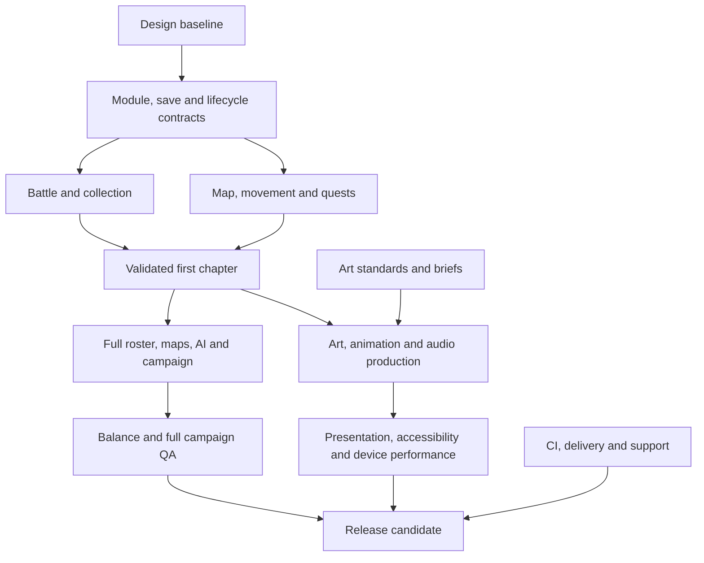

# Mossvale 1.0 development roadmap

Canonical live tracking: [Roadmap issue #1](https://github.com/King-Zalogon/mossvale/issues/1). This document records the initial audit and backlog; use the linked issues for current status. All tasks were open when this plan was created on 2026-09-30.

This is the coordination issue for turning the current Mossvale prototype into a complete, small single-player browser RPG. The plan is grounded in a source and browser audit of commit [8fc2c7b](https://github.com/King-Zalogon/mossvale/commit/8fc2c7b33251d7a8045b196712982be0489f4b20). It is a proposed 1.0 scope, not a claim that all of these features already exist.

## Recommended 1.0 target
- A 3–5-hour first campaign with a clear introduction, three region chapters and an explicit ending.
- Three distinctive regions with nine authored hub/route/shrine maps, six side quests, three guardian challenges and a final story resolution.
- 24 discoverable species/forms, including a small set of evolution lines; individual creatures, a six-member active party and reserve storage.
- Meaningful equipped moves, elemental strengths, a small status system, trainer/guardian AI, move learning, bounded leveling and a measured supply economy.
- Original isometric pixel art, intentional eight-direction animations, coherent music/SFX, keyboard and mobile-touch play.
- Reliable local saves, migrations, backup/export/import, settings, accessibility, tested performance and a reproducible release pipeline.
- Single-player and offline-first data. Accounts, trading/PvP, extra regions and native ports are separate optional product tracks, not 1.0 blockers.

## Audit findings
The current game has eight species, three palette-themed regions, capture/attack/guard/potion/switch actions, three guardian unlocks, local XP/coin progression, one chest per region, a journal, basic touch controls and local saves. It has a usable prototype loop, not yet a campaign-length game.

| Area | Current limitation | Implication |
| --- | --- | --- |
| Reliability | Nested save data is trusted; battle transactions are not resumable; asset errors resolve silently | Fix before adding more content or inviting long play sessions |
| Architecture | Simulation, data, storage, rendering and DOM menus share one compressed IIFE; CSS has seven long lines | Contract/module work unlocks safe parallel production |
| Exploration | All regions use the same ellipse, cross-path and camp/shrine/chest positions | Authored map/events pipeline and distinctive routes are needed |
| Battles | One basic and one elemental move, no cost on stronger elemental action, alternating enemy AI | More strategic choices and measured encounter balance |
| Collection | One record per species; duplicates are discarded for rewards | Individual creatures, party/reserve and migration work |
| Campaign | Hardcoded objective chain; no authored NPC quest graph, tutorial arc or ending sequence | Story/quest/event/content production |
| Presentation | Four static player directions, bobbing, a few props and beeps | Eight-direction animation, consistent art, battle presentation and sound |
| Production | No committed tests, tooling, CI, releases, license/provenance inventory or deploy automation | Testing/delivery/support need their own continuous lane |

### Reproduced browser failures
1. A v2 payload with `team: {"0": 7}` throws `Cannot create property 'xp' on number '7'` and prevents initialization.
2. Aborting `sprite8.png` still opens play with an invisible player and no error message.
3. Start capture and refresh immediately: orbs decrease from 12 to 11, but the encounter is discarded.

These were reproduced in local headless Chromium. Physical-device performance, natural campaign duration and full difficulty are **not** measured yet. Earlier workspace tests forced guardian HP to 1, so they establish unlock wiring, not balanced natural gameplay.

## Priority rules
- **P0:** Address now: reliability blockers and contracts/tooling that unlock production.
- **P1:** Essential systems and campaign content for 1.0.
- **P2:** Required 1.0 usability/presentation/testing/release completion, after the core chapter is proven. A P2 label does not make this work optional.
- **P3:** Explicitly outside 1.0. Evaluate separately after the release or with an explicit scope change.
Priority and dependency order are distinct. A high-priority task may wait for a contract; an early independent P2 art brief can start while engineering fixes P0 bugs.

## Delivery sequence and gates
1. **Foundation:** Fix save/asset failures, freeze design and ID/state contracts, establish readable modules and reproducible checks.
2. **Complete chapter:** Ship one authored meadow chapter with real moves, capture, party, quest, tutorial, save recovery and one naturally winnable guardian. Do not duplicate an unproven loop into all regions.
3. **Full campaign:** Produce the remaining maps, roster, quests, progression and narrative against stable schemas; complete the ending and collection routes.
4. **Beta and polish:** Measure real pacing/difficulty; finish art/animation/audio, accessibility, devices and performance; correct defects.
5. **Release:** Verify rights/credits, traceable packaging/publishing, diagnostics, candidate QA and rollback. Direct main commits remain permitted; no owner PR/merge approval is required.

## Parallel execution model
| Lane | Can start now | After contracts/first chapter | Coordination risk |
| --- | --- | --- | --- |
| Core engineering | Save crash hotfix, state/save/API design | Durable actions, collection and battle systems | One owner for schema/state/event contracts and migrations |
| Build/QA | Tooling, test scenarios and fixtures | CI regression suite, real campaign/device sessions | One seeded RNG/clock harness; continuous testing |
| World/content | Region sketches, story outline, quest/roster briefs | Separate maps, dialogues, encounters and quests | Freeze IDs/map/event schemas; review global flags/rewards |
| Art/animation/audio | Style references, asset list, provenance, sound briefs | Independent region/species batches | Shared dimensions/pivots/export rules and art direction |
| UI/platform | Entry/menu prototypes, input/accessibility audit | HUD, party/storage, save tools, device fixes | Shared focus/navigation and input contracts |
| Release/support | Inventory/docs, deployment investigation | Reproducible artifacts, support export, release gates | Single source/publishing owner; preserve access and saves |

Use short-lived branches for isolated work if useful, and integrate to main once the relevant checks pass; no required PR approvals. Do not assign multiple workers to rewrite `game.js` at once. Keep changes isolated by module/data/asset ownership, shared fixtures and small integration checkpoints. Maximize independent work only after contracts are stable.

The main integration paths are design → architecture/save/state contracts → battle/collection/world-event systems → first-chapter validation → content/growth/AI/campaign → balance and platform QA → release. Art/animation and device performance may become equally limiting paths; they must be scheduled early.

## Effort and uncertainty
The 36 required implementation issues estimate **170–284 focused person-days**, including engineering, design, art, audio and QA. Add roughly **25% integration/rework reserve: 213–355 person-days**. These are planning ranges, not delivery promises; prototype content tools, animation quality and battle redesign are the largest uncertainties. Track actuals after the first complete chapter and cut scope explicitly if needed.

A mixed team of about three full-time contributors might need roughly **16–26 weeks** once dependencies, role bottlenecks and testing are accounted for. One person covering every role could need about **11–18 full-time months**. Neither number scales linearly by adding agents or people. Optional P3 work is excluded from these totals; epic estimates are rollups and must not be double-counted.

## Progress log

- 2026-10-01: #8 and #12 implemented on branch `ccr-075e1d10-ok9hef` (`dist/save.js`, `dist/assets.js`, tests; see [SAVE_FORMAT.md](SAVE_FORMAT.md)). Issues stay open until reviewed against their acceptance criteria; remaining gaps: #8 save fixtures are not yet exported from real v1 data; #12 has no throttled-network or decode-failure browser test, and optional audio/font fallbacks are untested (no audio assets exist yet).

## Tracking
This backlog contains 36 required issues, five optional issues and five epics. Each task includes observed evidence, scoped work, acceptance criteria, verification, an effort range and parallelization guidance. No implementation work is marked complete merely because an issue exists.

## Epic index

- [ ] #2 — Runtime foundations, reliable saves and first playable chapter
- [ ] #3 — Creature collection, strategic combat and balanced progression
- [ ] #4 — Authored exploration, quests and a complete campaign
- [ ] #5 — Art, animation, audio and usable desktop/mobile play
- [ ] #6 — Testing, delivery and a supportable 1.0 release

## Required 1.0 work by phase

### 0 · foundation

- [ ] #7 — **P0**, Define the 1.0 game design and measurable completion target (2–4 days)
- [ ] #8 — **P0**, Prevent malformed saves from crashing startup and migrate to stable IDs (3–5 days)
- [ ] #9 — **P0**, Split the monolithic runtime into modules with explicit data contracts (5–8 days)
- [ ] #10 — **P0**, Add reproducible development tooling and GitHub quality checks (2–4 days)
- [ ] #11 — **P0**, Make encounters durable and handle pause, refresh and tab suspension (4–7 days)
- [ ] #12 — **P0**, Add a real loading state, asset validation and startup recovery (2–4 days)
- [ ] #13 — **P0**, Commit deterministic gameplay regression tests and fixtures (4–7 days)

### 1 · complete chapter

- [ ] #14 — **P1**, Create a data-driven map and event authoring pipeline (5–8 days)
- [ ] #15 — **P1**, Make traversal, collisions, portals and camera reliable on every map (4–7 days)
- [ ] #16 — **P1**, Implement meaningful move sets, battle rules and status effects (7–11 days)
- [ ] #17 — **P1**, Model individual creatures, active party and reserve storage (5–8 days)
- [ ] #18 — **P1**, Add a persistent quest, dialogue and world-event system (6–10 days)
- [ ] #19 — **P1**, Create a coherent inventory, shop and reward economy (4–7 days)
- [ ] #20 — **P1**, Add a title/continue flow and persistent player settings (3–5 days)
- [ ] #21 — **P1**, Make GitHub main the documented release source and automate verified delivery (3–5 days)
- [ ] #22 — **P1**, Prove a complete first chapter before scaling the campaign (6–10 days)

### 2 · full campaign

- [ ] #23 — **P1**, Give trainers and shrine guardians deliberate battle behavior (5–8 days)
- [ ] #24 — **P1**, Author a coherent 24-species roster with roles and evolution lines (8–12 days)
- [ ] #25 — **P1**, Build a bounded XP curve, move learning and evolution progression (4–7 days)
- [ ] #26 — **P1**, Make encounters varied, paced and discoverable (4–7 days)
- [ ] #27 — **P1**, Build nine authored maps with distinct exploration and secrets (10–16 days)
- [ ] #28 — **P1**, Deliver the first-play tutorial, campaign story and satisfying ending (6–10 days)
- [ ] #29 — **P1**, Add six side quests, regional secrets and collection goals (5–8 days)
- [ ] #30 — **P1**, Add save slots, portable backups and recovery tools (3–6 days)
- [ ] #32 — **P2**, Create a consistent art pipeline and full campaign asset inventory (10–16 days)

### 3 · beta and polish

- [ ] #31 — **P1**, Measure and tune natural campaign difficulty and pacing (8–12 days)
- [ ] #33 — **P2**, Improve exploration, battle, party and journal information design (5–8 days)
- [ ] #34 — **P2**, Make the game accessible across input, motion, color and text needs (4–7 days)
- [ ] #35 — **P2**, Harden touch input, orientation and browser compatibility (4–7 days)
- [ ] #36 — **P2**, Produce eight-direction movement and creature animation sets (8–13 days)
- [ ] #37 — **P2**, Profile and optimize rendering, asset delivery and battery use (4–7 days)
- [ ] #38 — **P2**, Add music, ambience and readable gameplay sound design (5–8 days)
- [ ] #39 — **P2**, Run a release-quality campaign, save and platform QA program (6–10 days)

### 4 · release

- [ ] #40 — **P2**, Document code, artwork, audio and font rights for distribution (2–4 days)
- [ ] #41 — **P2**, Add bounded diagnostics, feedback and support information (2–4 days)
- [ ] #42 — **P2**, Ship a verified 1.0 candidate, credits, release notes and rollback plan (2–4 days)

## Dependency and execution table

| Issue | Priority | Lane | Blocks on | Person-days |
| --- | --- | --- | --- | --- |
| #7 | P0 | Design | Ready now | 2–4 |
| #8 | P0 | Core engineering | Ready now | 3–5 |
| #9 | P0 | Core engineering | #7 | 5–8 |
| #10 | P0 | Build engineering | Ready now | 2–4 |
| #11 | P0 | Core engineering | #8, #9 | 4–7 |
| #12 | P0 | Client engineering | Ready now | 2–4 |
| #13 | P0 | QA automation | #10, #9 | 4–7 |
| #14 | P1 | World engineering | #9, #7, #8 | 5–8 |
| #15 | P1 | World engineering | #14, #11 | 4–7 |
| #16 | P1 | Gameplay engineering | #7, #9, #11 | 7–11 |
| #23 | P1 | Gameplay engineering | #16, #17 | 5–8 |
| #17 | P1 | Gameplay engineering | #8, #9, #7 | 5–8 |
| #25 | P1 | Game design + engineering | #17, #16, #24 | 4–7 |
| #24 | P1 | Creature design | #7, #16, #17, #22 | 8–12 |
| #26 | P1 | Gameplay engineering | #14, #24, #16 | 4–7 |
| #18 | P1 | World engineering | #7, #9, #8, #14 | 6–10 |
| #27 | P1 | Level design | #14, #15, #18, #22 | 10–16 |
| #28 | P1 | Narrative design | #7, #18, #27, #23 | 6–10 |
| #29 | P1 | Content design | #18, #27, #17 | 5–8 |
| #19 | P1 | Game design + engineering | #7, #8, #16, #18 | 4–7 |
| #31 | P1 | Game design + QA | #25, #23, #26, #19, #28, #29 | 8–12 |
| #20 | P1 | UI engineering | #7, #9, #8 | 3–5 |
| #30 | P1 | Client engineering | #8, #20, #17 | 3–6 |
| #33 | P2 | UI/UX | #20, #16, #17, #18 | 5–8 |
| #34 | P2 | Accessibility + UI | #33, #20, #15 | 4–7 |
| #35 | P2 | Client QA + engineering | #20, #15, #33, #11 | 4–7 |
| #37 | P2 | Rendering engineering | #9, #14, #32, #36 | 4–7 |
| #36 | P2 | Animation production | #7, #32, #15 | 8–13 |
| #32 | P2 | Art production | #7, #24, #14 | 10–16 |
| #38 | P2 | Audio production | #7, #11, #32 | 5–8 |
| #39 | P2 | QA | #13, #7, #28, #29, #25, #23, #26, #19, #30, #35, #34, #37 | 6–10 |
| #40 | P2 | Release management | #32, #38 | 2–4 |
| #21 | P1 | Build/release engineering | #10, #12 | 3–5 |
| #41 | P2 | Client/release engineering | #11, #30, #21 | 2–4 |
| #42 | P2 | Release management | #31, #39, #34, #35, #37, #40, #21, #41, #28, #30 | 2–4 |
| #22 | P1 | Integration + design + QA | #14, #15, #16, #17, #18, #19, #20, #13 | 6–10 |

## First execution queue

- #8: Prevent malformed saves from crashing startup and migrate to stable IDs. Ready to start now.
- #12: Add a real loading state, asset validation and startup recovery. Ready to start now.
- #7: Define the 1.0 game design and measurable completion target. Ready to start now.
- #10: Add reproducible development tooling and GitHub quality checks. Ready to start now.
- #9: Split the monolithic runtime into modules with explicit data contracts. Wait for #7 for final integration; prepare independent work now.
- #11: Make encounters durable and handle pause, refresh and tab suspension. Wait for #8, #9 for final integration; prepare independent work now.
- #13: Commit deterministic gameplay regression tests and fixtures. Wait for #10, #9 for final integration; prepare independent work now.
- #22: Prove a complete first chapter before scaling the campaign. Wait for #14, #15, #16, #17, #18, #19, #20, #13 for final integration; prepare independent work now.

The first-chapter checkpoint #22 is a hard gate for bulk map/roster production. Content, art and story briefs can begin earlier, but final definitions should follow what the chapter proves.

## Main dependency paths

This is an integration diagram, not a computed calendar. Use the exact issue dependencies above; documentation/design spikes can overlap, and the art/device path can become limiting. QA and CI run continuously across all phases.

## Optional future tracks — excluded from 1.0 estimate

- [ ] #43 — **P3**, Evaluate opt-in cloud saves and cross-device accounts
- [ ] #44 — **P3**, Evaluate trading or PvP as a separate online product track
- [ ] #45 — **P3**, Expand postgame with rematches, challenge routes and new regions
- [ ] #46 — **P3**, Evaluate installable offline play and safe service-worker updates
- [ ] #47 — **P3**, Evaluate translations, controller input and additional platform ports

## Maintenance rules

- Leave implementation issues open until their acceptance criteria and evidence are complete; the analysis itself does not complete the work.
- Update child status, epic checklists and this roadmap when work ships; re-estimate after the first chapter.
- Priority is carried in titles and issue metadata; existing labels classify bugs, enhancement, documentation and accessibility. Phase/epic links provide grouping without relying on unavailable project or milestone tools.
- Keep shared schemas, migration formats, state events and release ownership coordinated; assign separate module/map/species files for parallel work.
- No mandatory PR or merge approval: use direct main integration when checks pass, or temporary branches that can be integrated without waiting for owner approval.

