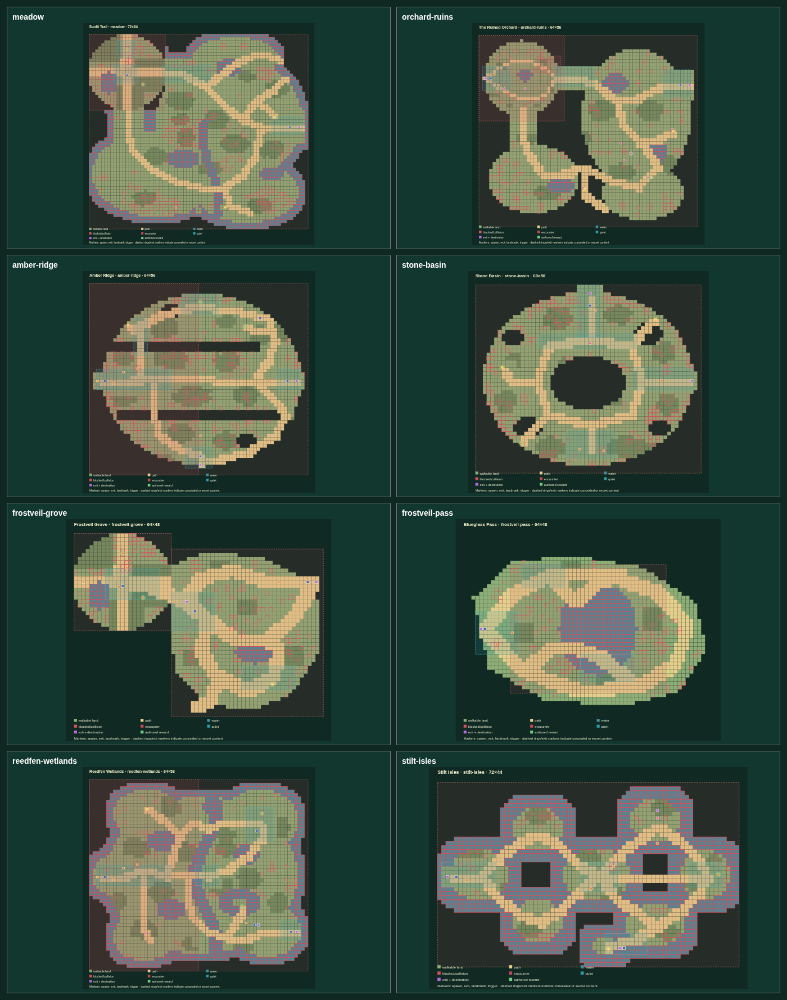
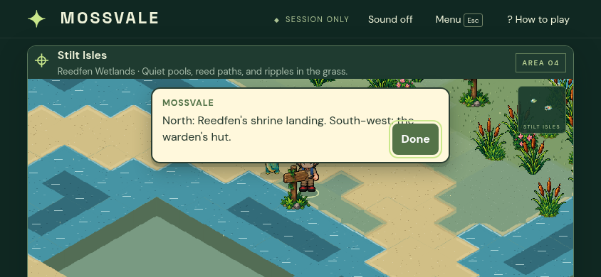

# Route rhythms across the eight shipped maps

This pass treats each map as a short exploration activity with its own readable shape. The layout sheets below name the arrival, goal, meaningful choice, safe return and landmark cue; route lengths come from `npm run maps:design-report` on the shipped collision grid. The time column is a lower-bound estimate at the game's 2.8-tile/s walk speed (`tile steps ÷ 2.8`), before reading signs, interacting, detouring or meeting a creature. It is not presented as a measured player traversal time.

The paired spatial sheets use the #274 legend: terrain and collision, encounter/quiet footprints, authored landmarks, spawns and exits. Baseline sheets show the missing exit cues and shadowed habitat that prompted this pass. After sheets show the authored marker positions and corrected encounter precedence.

## Before

At baseline, the spatial report found five exits without an authored sign within 12 walkable tile centers and two orchard encounter habitats hidden by first-match precedence (10 warnings across all maps, including three gated reverse routes). Amber Ridge said “the next island” despite the eastern destination being Frostveil Grove; Frostveil used the same generic phrase for Reedfen. The long routes were reachable, but their fork cues were clustered at the start or absent near the decision.

## Eight layout sheets

| Map and activity | Entry → main route and destination | Optional route / payoff | Safe or recovery route | Silhouette and first-time decision |
| --- | --- | --- | --- | --- |
| **Sunlit Trail (`meadow`)** — an open stream-side trail branches around tree belts before reconverging at the orchard road. | `camp` → north shrine (7 tile steps; ~2.5 s estimate), then the eastern orchard exit (55; ~19.6 s). | Leave the main trail for the quiet grove and old well; the hollow oak offers a second quiet return to the trail. | Camp lawn and shrine climb are quiet corridors; the ranger and cottage remain beside camp. | The stream and hollow oak define the meadow. At the first fork, choose the shrine climb or the long orchard trail; the existing camp sign names the destinations. |
| **The Ruined Orchard (`orchard-ruins`)** — two orchard islands turn the journey into a sequence of shaded rows, a press clearing and a broken-wall crossing. | `camp` → follow the long eastern trail to Amber Ridge (57; ~20.4 s); the Meadow return is immediately behind the arrival. | The cider press and fallen wall turn the central rows into clue stops; these remain environmental discoveries, not secret-route directions. | The west trail returns to Meadow; the camp ranger is one tile from the entry. | The old press anchors the eastern half. The choice is to continue along the broad east trail or pause among the apple rows. Reordering encounter-zone precedence restores the sunlit grass habitat for both authored arrivals. |
| **Amber Ridge (`amber-ridge`)** — a long ridge spine offers a tight north cut, an open parallel trail and a south drop into a circular basin. | `camp` → crystal shrine (29; ~10.4 s) → eastern Frostveil trail after the seal; the west trail returns to the orchard. | The Sunstone shelf and overlook chest reward leaving the spine; the south trail to Stone Basin is a recoverable side expedition. | Rowan's lodge and the west return are at the camp entrance; the basin has its own return to the ridge. | Red rock spires and the high shrine form the ridge silhouette. The first meaningful choice is short/tight versus long/open; the fork markers now name Frostveil and the Basin where those trails actually diverge. |
| **Stone Basin (`stone-basin`)** — a circular rim route skirts a central chasm and feeds a quarry spur, alcoves and a ridge gate. | `camp` → south around the crater to the quarry keeper (37; ~13.2 s) → east gate to Amber Ridge (25 from camp; ~8.9 s). | The west quarry alcove and south-west nook branch from the loop; the nook chest pays the detour. | The north ridge gate returns to Amber Ridge; the quarry hut is a quiet recovery point. | The central void and rim vista make a distinct “circle then choose” map. The basin sign establishes the loop; the east gate marker confirms the return at the far junction. |
| **Frostveil Grove (`frostveil-grove`)** — a north shrine climb, sheltered south pass and long eastbound lakeside trail make a three-way snowy fork. | `camp` → shrine (7; ~2.5 s) → Reedfen exit after the seal (48; ~17.1 s). | The Blueglass Pass is a short optional out-and-back (15 to its exit; ~5.4 s); the icefall ledge is a second quiet landmark. | Return west to Amber Ridge; camp's ranger and cottage are beside the spawn. | The blue lake and icefall anchor the grove. Camp signs now name Reedfen and Blueglass Pass; the eastern waymark confirms Reedfen at the distant fork. |
| **Blueglass Pass (`frostveil-pass`)** — a compact, sheltered loop turns the frozen pool into a contained excursion between grove and pine shelter. | `camp` arrives beside the Grove return (0 steps); the sign points around the pool and back to the grove. | The blueglass cache rewards exploring the far bank, away from the return. | The west-edge Grove exit is always available; the pine shelter is a rest point three steps from the arrival. | The frozen pool and shelter distinguish this as a restful side loop rather than another through-route. The decision is whether to take the quiet shelter stop or complete the far-bank excursion. |
| **Reedfen Wetlands (`reedfen-wetlands`)** — a fan of boardwalk crossings splits the shrine approach, the Stilt Isles route and a companion-gated water cut. | `camp` → north-east shrine (45; ~16.1 s) or south-east boardwalk to Stilt Isles (55; ~19.6 s); west returns to Frostveil. | Brooklet can reveal the shallow-water cut to Lantern Islet (43; ~15.4 s); its clue stays at the crossing and does not appear on the public trail sign. | The west path returns to Frostveil; Nell's cottage and quiet shore corridors offer recovery between crossings. | The reed banks and heron blind define the wetlands. The camp sign distinguishes shrine from boardwalk; the separate cut marker preserves spoiler-safe discovery. |
| **Stilt Isles (`stilt-isles`)** — a figure-eight of narrow planks crosses isolated isles between the warden's hub, lantern islet and summit landing. | `camp` → central warden (31; ~11.1 s) → high boardwalk to Reedfen's shrine landing (48; ~17.1 s). | The lantern islet is a short spur from its return spawn; the summit chest rewards the high loop. | West returns to the Reedfen camp; the shallow-cut return remains available to players who discovered that route. | Water-separated platforms and the central hut make the bridge choice legible. The new high-plank marker identifies the shrine landing before the north branch. |

Encounter habitat footprints are also part of each layout sheet: Meadow `tall-grass` / `meadow-wilds`; Orchard `sunlit-meadow-path`, `old-orchard-grass` / `orchard-wilds`; Amber Ridge `ridge-grass-west` / `ridge-grass-east`; Stone Basin `basin-grass`; Frostveil Grove `grove-grass` / `outer-grove-grass`; Blueglass Pass `blueglass-grass`; Reedfen `reed-shallows` / `reed-deeps`; Stilt Isles `isle-grass`. The spatial sheets show these zones alongside quiet corridors and landmarks, so habitat gaps and route overlap can be reviewed at map scale.

## After

The after report removes all five missing-wayfinding-cue warnings and both unavailable-orchard-habitat warnings. All required starts and targets remain reachable. The three remaining report warnings are the existing reverse-exit gates from Amber Ridge, Frostveil Grove and Reedfen; these are progression-aware return conditions, not missing paths. Every exit now has a written sign within 12 tile centers (new cue distances: Amber east 5 / Basin 6, Frostveil east 6, Stilt north 4, Stone east 4; existing signs cover the other exits).

Desktop and phone-landscape captures show the new fork signs in the rendered playfield and their complete interaction text at 1200×820 and 844×390. The Stilt Isles wording was shortened after the first phone capture so the destination and hut labels fit without competing with the dialogue button.

## Play observations and limits

Each required camp arrival was loaded into a clean browser play session, then the normal walking controls were held to the listed landmark or exit; the capture viewport was 1100×850 and game speed was unchanged. The following one-run controller traces end inside the normal interaction radius. A waypoint is a reached half-tile navigation sample; a backtrack is counted only when a successful move traverses an already-used grid edge in reverse. “Replans” counts controller recoveries after a blocked waypoint.

| Map | Destination | Controller time | Waypoints | Backtracks | Replans |
| --- | --- | ---: | ---: | ---: | ---: |
| Sunlit Trail | shrine | 2.4 s | 8 | 0 | 2 |
| The Ruined Orchard | east ridge exit | 17.8 s | 112 | 43 | 5 |
| Amber Ridge | crystal shrine | 14.4 s | 88 | 36 | 7 |
| Stone Basin | quarry keeper | 16.1 s | 109 | 32 | 3 |
| Frostveil Grove | shrine | 2.4 s | 15 | 0 | 0 |
| Blueglass Pass | pine shelter | 1.3 s | 10 | 0 | 0 |
| Reedfen Wetlands | shrine | 16.5 s | 117 | 20 | 2 |
| Stilt Isles | warden | 11.9 s | 78 | 2 | 3 |

These instrumented timings include browser/control overhead and are traversal observations, not human stopwatch benchmarks. The design report separately gives shortest route lengths and lower-bound walk estimates. This distinction keeps route length from standing in for exploration quality. The longer journeys required more controller recovery/backtracking around obstacle approaches; their junction signs now give a destination cue at the decision point. The report confirms vertex-disjoint alternatives on the listed required routes; its grid model does not prove that a player reads prose or that continuous movement never clips a corner. The local evidence combines the eight map-controller traces, collision/route report, and desktop plus phone-landscape captures; it is not an independent human phone playtest.

The map sign additions are on the rendered playfield and the contact sheets compare their spatial placement at equal scale. The sign bodies still require interaction to read. Secret Reedfen wording remains confined to the existing shallow-cut marker, and the treasure/minimap conventions are unchanged.
