# The hollow beneath the orchard

Design brief for [#255](https://github.com/King-Zalogon/mossvale/issues/255), a candidate short adventure slice under [#248](https://github.com/King-Zalogon/mossvale/issues/248). This is a buildable proposal, not shipped story/map content, an approved art batch, or evidence that the scene is fun. It narrows the research in [the #248 research report](https://github.com/King-Zalogon/mossvale/issues/248#issuecomment-6035151873) to a testable route and distinguishes already-working systems from actual gaps.

## Design promise and hypothesis

In the Ruined Orchard, Keeper Mara blames a wild Bramblebuck for the loss of irrigation water. The player can see the damage and the animal's marks, but the older failure and the wet tracks point to a different order of events: a rotten sluice has flooded the animal's den and displaced its young. The adult has worsened one board while trying to protect them. The player decides whether to divert the water first or guide the family to safety first. Both solutions restore a useful route; each leaves a different visible condition and a different memory in the next scene.

The hypothesis is that players will revise their first explanation when physical evidence changes the timeline, then find the priority trade-off legible without being told which answer is morally correct. The adult's damage is real; the root failure predates it. The story should hold both facts at once.

The player keeps whichever starter and party they already have. The wild adult and its young belong to the orchard, are not party members, and are never capture rewards. A captured Bramblebuck in the player's team remains a separate individual. Do not assume the player owns a Fernling or Brooklet.

## Progression and scene boundary

Use the existing `meadow` → `orchard-ruins` → `amber-ridge` route. Start the mystery after `meadow.seal`, with Mara at `landmark:mossvale/orchard-ruins/orchard-ranger`; return from the orchard with the existing `back-to-meadow` exit or continue east through `east-to-ridge`. The current meadow exit to the orchard is open before the seal, so the build must keep pre-seal orchard dialogue as neutral exploration guidance and not expose the accusation/choice early. Do not add a second pack, a save schema, an unrelated chest, or a new milestone.

Keep the existing orchard's west entry, east ridge gate and two lower-row shortcuts as the route scaffold. The two `oak-grove` set pieces and three `cairn` set pieces supplied by #254 remain landscape, not evidence by themselves. The middle and lower orchard should contain one short loop between Mara, the cider press, the old watercourse, the den and the return trail. Preserve the quiet camp/trail/gate corridors and route around required interactions; incidental encounters must not interrupt clue reading or become mandatory grinding.

## Clue and decision graph

The two labelled evidence routes are alternatives to establish the critical fact; either can support the decision. Seeing both is useful corroboration, not a checklist. The lower-row route returns to the central trail so a missed clue never requires retracing the whole map.

```mermaid
flowchart LR
  Gate[After meadow.seal: Orchard west entry] --> Mara[Mara states the accusation and the dry-row problem]
  Mara --> Loop[Central trail opens a short lower-row loop]
  Loop --> Physical[Route A: follow fresh wet tracks from the old sluice to the den]
  Loop --> Record[Route B: inspect press maintenance marks and ask Mara about the last flow change]
  Physical --> Fact[Both routes can establish: rot and the first flood mark predate the fresh Bramblebuck scrape; the den is wet]
  Record --> Fact
  Physical -. optional corroboration .-> Record
  Fact --> Family[Reveal the displaced young and the adult returning to guard them]
  Family --> Decision{Choose which harm to address first}
  Decision -->|Water first| Release[Operate the shared bypass; any party can reach the dry-side control]
  Decision -->|Family first| Escort[Guide the family to the dry hollow; use the authored non-lethal escort encounter]
  Release --> Reunion[Family safe; lower rows regain water; record channel-first outcome]
  Escort --> Relocated[Family safe; old rows remain dry until Mara finishes the slower repair; record family-first outcome]
  Reunion --> Loop
  Relocated --> Loop
  Reunion --> East[Return to east gate; Rowan acknowledges Mara's note in Amber Ridge]
  Relocated --> East
  Brooklet[Optional Brooklet shallow-water shortcut] -. never required .-> Physical
```

### Purpose of each orchard region

| Existing/target region | Player question or action | Keep out of this region |
| --- | --- | --- |
| West entry and Mara's ranger point (`camp` spawn near `[3,12]`) | Where am I, who is worried, and what is at stake? Rest safely; identify the west return and east destination. | No instant fight or clue dump. Keep first-time dialogue conditional on `meadow.seal`. |
| Press and old watercourse (`cider-press` is `[30.4,44.4]`; the broken wall is `[56.4,27.4]`) | Did the mechanical failure or animal damage happen first? Compare a physical route with Mara's maintenance account. | Do not present the current cider-press flavor text as water evidence; give the press a reviewed inspection detail before relying on it. |
| Lower-row loop and proposed den | Where did the spilled water go, and why does the adult return? Discover the family in a short, quiet moment, then return naturally to the choice. | No repeated encounter checks on the clue footprints; the two #254 groves are scenery unless a new reviewed clue is explicitly added. |
| East gate (`east-to-ridge`) | What changed and what trail remains? Continue to Rowan on the route the player already intended to travel. | No trip back to Mara required to finish or hear the callback. |

The orchard's existing `old-orchard-grass` encounter zone offers an optional Bramblebuck opportunity at levels 5–7. Leave the full clue network and both outcomes available if the player skips or loses that encounter. Do not move the only Bramblebuck capture into the mission objective or make its drop/reward carry the story clue.

### Evidence that supports the inference

1. **Route A, physical:** inspect the damaged sluice from the safe bank, then follow the fresh wet track and displaced nest material to the den. The old flood line and softened wood are visibly older than the fresh hoof/claw scrape. The return track points back toward the young rather than away with stolen fruit. A player can infer that the adult aggravated a failing channel while trying to reach the den.
2. **Route B, conversation plus maintenance marks:** the cider-press maintenance marks show that flow had already dropped before the most recent Bramblebuck visit. A conditional question lets Mara admit she had been reusing the aging gate rather than replacing it. She can identify which low row became wet first; the player follows that route to the den. The conversation corroborates a physical location rather than replacing the world clue.

The adult is first seen at a distance and returns to the same den after the player leaves its sightline. Its reaction is protective and directed toward the den, not toward the player's active companion. The young are shown tucked into the damp hollow with carried leaves and mud. A later close view makes clear that the seep is reaching them. These are observable facts, not a narrator's verdict. Sound is optional: wet ground, track shape, the adult's return and a changed water direction carry the information.

The visual truth must survive both clue routes and both decisions: a weathered split or rot predates the scrape; there is a visible path from the spill to the den; and the adult's footprints return to the young. If a normal-scale screenshot does not let a tester point out those three facts, revise the composition before adding dialogue.

### Playable dialogue and action beats

These short lines are a first-pass script, not fixed lore. Their purpose and trigger are part of the test; revise wording if the evidence carries the wrong meaning.

| Order / proposed event | Beat and sample player-facing line | Purpose |
| --- | --- | --- |
| `mara-water-loss` | Mara: “The lower row is dry again. That Bramblebuck pulled at the feeder board. Something has made a den by the old channel, and I can't leave the water like this.” | One claim plus two concrete stakes; begin after `meadow.seal`. Pre-seal line stays exploration-only. |
| `sluice-old-mark` | Inspection: “The split timber is dark and soft. This break has been open through more than one rain.” Then the brighter scrape: “These marks cut through the old mud.” | Make the timeline visible and let the player distinguish old structural failure from recent animal damage. |
| `press-repair-record` | Press inspection: “The waterline marks stop before last harvest.” Mara, when asked: “I saw the flow drop then. I kept meaning to replace that board.” | Alternate path to the same causal inference, through a map clue and accountable testimony. |
| `den-family-seen` | No automatic verdict. Show the water reaching the nest; the adult turns to face the player, then turns back toward the young. | Let framing and movement reveal protective intent, not a narrator label. |
| `orchard-decision` | Choice: “Open the bypass first” / “Get the family to dry ground first.” On the second option: “Keep the young moving; I’ll keep the adult's attention.” | Name priorities and the immediate task. Neither option accuses the other player of being cruel or foolish. |
| `outcome-water-first` / `outcome-family-first` | Mara reacts to what changed on screen, not merely “quest complete.” She thanks the player for the crop repair or for moving the young. | Confirm immediate consequence and state; grant the same once-only payment. |
| `rowan-orchard-note` | Water-first: Rowan says Mara's lower row is flowing and points out its trail. Family-first: Rowan says Mara's moved family has settled and that the repair is still underway; he gives the same onward direction. | A later, ordinary NPC interaction proves which choice was remembered and keeps the story moving. |

The `mara-water-loss`, `sluice-old-mark` and other names in this table are proposed authoring IDs. Do not register them as available runtime IDs until #260 and the continuity implementation validate their triggers, once/repeat behavior and persistence.

### Family-first encounter states (proposed, not present in today's battle engine)

| State | Entry, player information and transition |
| --- | --- |
| `unseen` | No mandatory encounter. The adult may be glimpsed at a distance; evidence routes remain open. |
| `evidence-known` | The player has found the den and can see the adult guarding it. No attack/capture prompt. This is where the player may choose water-first or family-first. |
| `family-first-selected` | The goal reads “Give the young time to reach the dry hollow.” Explain the objective before combat; the player can still back out without spending resources. |
| `escort-active` | A bounded repeatable battle objective keeps the adult occupied while a clear progress marker shows the young moving. A forecast describes its next actual action. Success is reaching the escort threshold, not fainting or capturing the adult. The active party, items and normal turn order remain the player's real Mossvale team. |
| `escort-recovered` | On success, close the encounter without capture; show the family at the dry hollow and the adult joining them. Record `orchard-outcome=family-first` once. |
| `retryable` | On loss, flee, refresh or interrupted save, leave no partial outcome/reward and keep the family safe at the den. Restore the existing battle checkpoint correctly; let the same interaction be retried or the player choose water-first. |

The completion threshold, turn objective, non-capture resolution and save behavior are a bounded contract for #264/#258, not assumed features. Test start, first enemy turn, completion, defeat/flee, refresh during combat, retry and reload after each outcome. Do not quietly translate “occupied for three turns” into HP defeat or let the wild adult be added to the party.

| Encounter result | Narrative state and reward rule |
| --- | --- |
| Escort objective succeeds before HP defeat | End the encounter as `escort-recovered`; no capture or standard wild-victory reward. Continue the family-first scene and pay the shared 10-coin Mara reward only after the site changes. |
| Adult reaches zero HP first | Do not faint, capture or award the adult. Stop this attempt safely, keep the family at the den, and offer a retry or water-first route. Preserve the ordinary team-recovery contract. |
| Player chooses capture or attempts to flee | Capture is unavailable for this authored non-capture objective; flee leaves the encounter, does not record an outcome, does not move the family and does not pay Mara. Make that result explicit before combat. |
| Party loses, player cancels before start, or battle is interrupted | No branch/reward is committed; keep the family at its stable den state. Resume a checkpoint or return to the same retry point without duplication. Water-first remains available. |

## Choice, consequence and continuity

Offer the choice only after the den and the two-source evidence are understood:

| Player choice | Required route and risk | Immediate authored consequence | Justified reward and next callback |
| --- | --- | --- | --- |
| **Divert the water first** | Walk the dry bank to the bypass and open it with Mara. This route uses ordinary movement and interaction, so every starter can reach it. Brooklet may cross a shallow optional cut and save a short return, but never opens the only control. | The lower orchard's channel flows again; the adult keeps the young in their dry upper nook. Show the water line change, then the family settling instead of fleeing. | Mara gives **10 coins once** as payment for the repair and leaves Rowan a note. The later ranger line reports the lower row green again and the family still nearby. |
| **Move the family first** | Guide the young along the dry hollow route while the adult blocks the way. Use a short, repeatable, explicitly non-capture encounter objective: hold its attention/guard the moving group until the young pass; ordinary attack-only defeat cannot be the hidden success condition. If the player loses or leaves, the interaction remains available and the young return safely to the den. | The family reaches the dry hollow before the bypass is opened. The orchard can be repaired after the danger is removed, but its lower row stays visibly dry for this visit. The adult follows the family and ceases guarding the jam. | Mara gives **10 coins once** as payment for getting the family clear and sends Rowan a note. The later ranger line remembers the family-first choice and points to the next trail without requiring a return trip. |

Both routes protect the family, reveal the water failure, make the eastward route usable and give Mara responsibility for the old gate. Neither has a secret “correct” ending or better power reward. Keep rewards matched; the difference is the player's priority and the world/story state. No choice should require capturing the adult, owning a named species, defeating a randomly selected wild creature, returning to Mara repeatedly, or walking back over the entire clue route. Keep one interaction available to revisit the final explanation without paying the reward again.

The stable outcomes below are **proposed narrative values**, not current runtime flag IDs: `orchard-outcome=water-first` and `orchard-outcome=family-first`. Preserve one outcome atomically with the resolution and expose it to Rowan's optional first conversation in Amber Ridge. Do not encode the choice in `orchard-ruins.chest`, `orchard-ruins.seal`, a species catch, or text that disappears on reload. A return trip should not be needed to hear the callback; visiting Amber Ridge after the resolution is the next-scene callback.

Possible concise callback copy: **water-first:** “Mara's note says the lower row is flowing again. Follow the blue marker north toward the Ridge shrine.” **family-first:** “Mara's note says the young are safe in the dry hollow. The lower row still needs work; follow the blue marker north toward the Ridge shrine.” Both follow the same current Amber objective and point to the same gate. These conditional lines require the proposed outcome contract; today's `when` conditions cannot express them.

## Authoring beats, purposes, assets and implementation owners

Canonical IDs below are existing catalogue IDs when prefixed `visual:`, `species:`, `map:` or `move:`. New asset names and outcome values are proposal labels, not available catalogue entries. Placeholder art is permitted only in a marked development build; replace it and visually review the complete scene before owner playtest.

| Beat and purpose | Current, verified assets/data | Pose and interaction required in the slice | Gap and delivery mapping | Graybox alternative, never final visual |
| --- | --- | --- | --- | --- |
| Enter the orchard; frame Mara's concern and the dry rows without a HUD mission dump. | `map:mossvale/orchard-ruins`; `landmark:mossvale/orchard-ruins/orchard-ranger`; `visual:person-gardener`; `visual:prop-orchard-wall-broken`; `visual:prop-cider-press`. | After `meadow.seal`, Mara faces the player and directs attention toward the blocked channel. Before that seal, preserve neutral guide dialogue. Show a usable label and short bottom dialogue without covering the speaker or clue. | Static gardener pose, lines and prop do not express waterworks or suspicion. #236/#259 handle readable/staged dialogue; #260 authors map beats. Art direction and source/review IDs are required for any new prop. | Existing Mara, path sign and map label can guide route testing. Do not ship an irrigation speech over unrelated scenery. |
| Trace the channel and establish chronology. | `terrain:water`, `visual:prop-orchard-wall-broken`, `visual:prop-cider-press`, #252 procedural water/shore rendering; #254 deterministic `oak-grove-*`/`cairn-*` prop groups. | Inspect the old sluice, read the old flood edge, follow fresh prints toward the den. The alternative route uses maintenance marks plus Mara's conditional answer. A quiet patch around evidence keeps random encounters out of reading beats. | No sluice/channel/maintenance-board/footprint art or evidence state exists. New source art must make old/new marks readable at 56×28 tile scale. #260, with #258 for persisted clue/outcome conditions and #261 for optional help. | For route testing, use removable editor geometry or one generic prop with a `[GRAYBOX CLUE — replace before visual review]` label. Never claim this validates story readability. |
| Reveal adult and young as a family, distinct from the player's companion. | `species:mossvale/bramblebuck`; `visual:creature-bramblebuck`; `visual:creature-bramblebuck-follower`; `move:briar-brace`. | Reveal from behind the den; adult returns to face/guard the young. Player can approach, leave and return. The active player creature remains with the player. Mara faces the player, then turns toward the channel; the adult faces the player briefly, turns to the young, then retreats. Make the stop/facing poses readable. | Existing Bramblebuck forms are not juvenile art and are not staged multi-actor interaction. Compose a distinguishable adult/young scene and den clue; preserve silhouette and feet; review over orchard ground. #259/#262; new visual IDs need source/provenance and #244/#245 normal-scale review. | A neutral, labeled silhouette may test route/motion only. Do not shrink the existing portrait and call it approved juvenile art. |
| Choose a priority and play a different approach. | Shared normal movement, battle and save path. `species:mossvale/brooklet` has `cross-shallow-water` / `wetland`; `move:ripple-rush` exists. The map already has a lower-row loop. | Any party reaches the bypass on foot; only an optional cut tests Brooklet. Family-first uses a short repeatable escort objective, readable forecast and retry/recovery, not capture combat. Specific #262 candidate: an owned Bramblebuck follows the wild adult’s returning hoofprints to the family’s dry upper nook, shortening the loop and revealing the reunion pose. It does not establish that the sluice failed first, replace either critical clue route, unlock a required control or select the ending. This field behavior is proposed, not present on `species:mossvale/bramblebuck` today. | Route gates do not change water flow; standard battles do not protect/escort actors; no named story branch feeds later dialogue. #260/#262/#264 for rules; #256 for forecast; #258/#265 for durable branch and visible reconvergence. | A labeled boardwalk tests all-party access. Brooklet's tag can test a later optional revisit only, not either first-visit outcome. |
| Show the consequence at the site and in the next scene. | `orchard-ranger`, orchard exit to `amber-ridge`, `Ranger Rowan`, pack save and `events` journal. | Change water/family staging once, let Mara react, grant 10 coins once, then carry the outcome to Rowan's next interaction. Reload before/after the callback. | The save has no readable named outcome condition for later dialogue; `mapFlags` currently serve side-map chest state, not narrative choices. Add compatible bounded continuity rather than overloading chest/seal flags. #258/#265. | Paper review may compare two labeled Rowan replies. It is not persistence or changed-state art. |

### Existing capability audit at integration `75c9a0a`

| Capability | Actual implementation/evidence | Use here and limit |
| --- | --- | --- |
| Orchard route and space | `dist/maps/meadow.json`, `dist/maps/orchard-ruins.json`; `tests/maps.test.mjs`, `tests/biome-maps.browser.mjs`. Orchard is 64×56, has a west return, east gate requiring `meadow.seal`, two lower-row loop triggers, four existing landmarks and encounter zones. | Reuse its connection and loop; do not invent a fourth island or forward gate. Its current broken-wall/cider-press text is not this mystery. |
| Terrain and authored set pieces | `dist/src/render/terrain.js`, `tests/terrain.test.mjs`, `scripts/gen-set-pieces.py`, `tests/set-pieces.test.mjs`; delivered in #252/#253 and #254. Catalogue includes `terrain:water`, `visual:prop-cider-press`, `visual:prop-orchard-wall-broken`. | Ground texture, shallow/deep water distinction, path edges and generic orchard groves/cairns are available. A terrain renderer is not a designed irrigation prop, evidence, changed-state art or quest staging. The set-piece placements avoid the quiet routes/landmarks and do not communicate this plot. |
| Conditional dialogue and choices | `dist/src/domain/objectives.js`, `dist/src/domain/dialogue-choices.js`, `dist/src/controller.js`; `tests/objective-choices.browser.mjs`. Conditions include flags, met/caught/seen/visited/all/not. | Mara can offer data-authored dialogue and gated replies. Choices emit events, but the checked condition language cannot read a named earlier narrative outcome. Do not treat arbitrary emitted event names as saved branch state. |
| Linear objectives and event journal | `dist/src/domain/objective-events.js`, `dist/src/domain/scenes.js`, `tests/objectives.test.mjs` and `tests/objective-choices.browser.mjs`; #100 regression coverage. | Multi-stage linear progress can rebuild from event IDs and pay once. It is not a reconverging branch/continuity API, a full clue graph, or a way to test a narrative outcome in a later map. |
| Companion-gated routes | `dist/src/domain/companion-routes.js`, `dist/maps/reedfen-wetlands.json`, `tests/companion-route.browser.mjs`; catalogue `species:mossvale/brooklet`, `visual:creature-brooklet-follower`. | Brooklet's optional `cross-shallow-water` + `wetland` route demonstrates an ability/habitat gate; discovery stays hidden until met. Reuse that pattern for a bonus shortcut only. The boardwalk/recovery path remains open to all starters; no required orchard clue or outcome can depend on Brooklet. |
| Guardian tactics | `dist/src/data/tactics.js`, `dist/maps/registries.json`, `docs/GUARDIANS.md`, `tests/guardians.test.mjs`. Four shrine guardians forecast useful reactions; e.g. Meadow's brace, Amber's heavy attack and Reedfen's charge. | Credit the existing tactical teaching and use the same truthful-preview standard. Those shrine patterns do not make a standard wild Bramblebuck encounter an authored escort objective or prove that ordinary attack-only play is nonviable. #256/#264 are the exact follow-up. |
| Characters/props | `dist/src/data/assets.js`, `docs/ASSETS.md`, `docs/ART_REVIEW.md`; available IDs in the beat matrix. `person-gardener` is shared; `prop-cider-press` and broken-wall are static. | Reuse by visual identity, assign role in map data. Existing sprites provide useful graybox only where marked; they do not depict a sluice, muddy evidence, juvenile pair or alternate water/den state. |

No dependency needs a plot approval to start. The required route works for every selectable starter using ordinary walking/interactions; test every configured starter and preserve capture/rest access. A late Brooklet return is an optional advantage, never a key or substitute for the shared route. Check each acquisition map against the actual campaign order before promising that a species is available.

`dist/maps/index.json` offers all 17 registered species as random starters; the orchard zone `old-orchard-grass` also includes Bramblebuck at levels 5–7. Catching Bramblebuck in the orchard is an opportunity, never a requirement to solve the mystery. A field-reading benefit for an owned Bramblebuck is a candidate for #262 and is not implemented today. Brooklet's real shallow-water route uses an encounter in later Reedfen; treat it as an optional return shortcut, not a feature the player is expected to have on the first orchard visit. For all seventeen starters, test both choices with the arrival-level party. Never require a different element, a newly caught creature or repeated random encounters.

## Route purpose, quiet beats and time budget

Target **8–12 minutes** for one first-play resolution, beginning on arrival in the orchard with `meadow.seal`; do not count title/load time, a player's unrelated roaming or optional backtracking. A second resolution on replay should take 3–5 minutes using discoveries and the other route. Sample duration while observing ordinary keyboard and touch play; do not use debug teleportation for acceptance.

| Segment | Target | Purpose and pacing rule |
| --- | ---: | --- |
| Entry and Mara | 1 min | Ask one concrete question, see the dry row, then let the player move. No objective-modal interruption. |
| First evidence route | 2–3 min | Follow one environmental clue chain. Do not require a wild battle, rare creature, or reading every object. |
| Corroboration / short loop | 1–2 min | Optional alternative clue path returns to a familiar landmark. Allow a quiet pause at the den reveal. Avoid repeating the same full loop to acquire a missing fact. |
| Choice and resolution | 2–4 min | State the two priorities in player terms; make each short enough to test both without a grind. Battle path must be retryable. |
| Mara, route and callback setup | 1 min | Show consequence before explaining it; reward once; put Rowan on the already-required Amber route. |

The clue loop has one turn-back and rejoins the east trail. Brooklet may cut across a shallow optional branch, but a missing ability cannot force a dead end or a return to Meadow. Keep encounters outside clue/dialogue footprints and avoid spawning immediately after a quiet reveal. Do not add another collectible solely to make the timer or inventory look busy.

## Falsifiable playtest and revision plan

Run unprompted sessions with each configured starter (initial minimum: one observation per starter; then five first-time players/agents for exploratory comprehension). Do not present the diagrams or explain the mystery first. Small samples reveal misunderstandings; they do not establish broad player preference.

1. **Inference:** After either evidence route, ask “What happened to the water, and what did the animal do?” Pass when at least 4/5 can distinguish the older failure from the fresh scrape and mention the young without being told. If fewer do, add or strengthen a readable contradictory mark on the route they used; do not solve it with a longer exposition bubble.
2. **Evidence independence:** Start two trials from different clue routes. At least 4/5 should find the relevant den and enough evidence to make the same informed choice within six minutes, without a forced full-map return. If not, change landmarks/route visibility before adding hint text.
3. **Choice:** Before selecting, ask what will be different immediately after each option. At least 4/5 should predict the water-first versus family-first priority and one visible consequence. If the choice sounds cosmetic or one option seems mandatory, change the risk/consequence or remove it; do not add a superior stat reward to fake meaning.
4. **Encounter use:** In the family-first route, record actions used, abandoned turns, recovery and retries. The non-lethal objective must complete without catching/knocking out the parent and be reachable with every starter. If attack-only is the only reliable strategy or a move that is unaffordable is the required counter, revise the encounter before testing enjoyment.
5. **Consequence noticed:** Within 30 seconds of the resolution, at least 4/5 should notice the changed water/family staging and correctly identify which priority they chose; the Rowan callback must match after save/reload. If not, strengthen the environmental state or callback placement before adding text.
6. **Pacing/access:** Median first-play time should fall between 8 and 12 minutes, with no mandatory backtracking and no required random encounter. A measured median above 12, two or more forced return trips, an inaccessible clue, a lost/duplicated reward after reload, or any starter lock is a revision blocker.

Capture the map and actor grouping at actual gameplay size on desktop, phone portrait and phone landscape, for the den reveal and both outcomes. Record correctness, legibility, decision comprehension, pacing and enjoyment separately. Passing the numerical questions does not declare the scene fun or the art approved; owner taste remains a final evaluation after the complete playable slice exists.

## Implementation handoff and local review boundary

This brief feeds #260–#265 and then #248/#245. Specifically: #260 owns the clue graph, authored water landmarks and map/event placement; #258 owns durable role/choice continuity; #259 owns the staged facing/movement/recovery contract; #261 supplies optional capability-aware hints; #262 supplies distinct species identity/field affordances; #263 defines temporary condition setup; #264 owns a non-defeat encounter objective; #256 verifies forecasts; #257 compares choices from matched states; #265 implements visible reconvergence. Implementers must update current source registries, map integrity hashes, catalogue evidence/limitations and tests. The story must not claim these features are available before that work lands.

Local design review is: read this brief beside the live orchard map and [quality plan](../QUALITY_PLAN.md), inspect all listed asset IDs in the [catalogue](../CATALOGUE.md), and use the test questions as a paper walkthrough. This documentation change does not modify shipped content, so it has no new playable map build or gameplay screenshot to present. The assembled slice must still be built, captured at play scale and tested through ordinary input in #248 before that slice is called complete.

### References

- [#248 research report: playable quality and reusable adventure design](https://github.com/King-Zalogon/mossvale/issues/248#issuecomment-6035151873) — inspected source excerpts and project-specific gaps; proposals are not implementation evidence.
- Mobius Digital, [Demaking Outer Wilds](https://www.mobiusdigitalgames.com/news/demaking-outer-wilds) — paper/text clue-network prototyping and the cost of too-dense clues.
- ink, [Writing With Ink: weave and state tracking](https://github.com/inkle/ink/blob/master/Documentation/WritingWithInk.md) — reconverging story paths can retain a meaningful prior choice.
- Tuxemon, [event actions](https://github.com/Tuxemon/Tuxemon/tree/development/tuxemon/event/actions) — open-source example of data-described world interactions; use as a reference, not imported code or art.
- Existing Mossvale evidence: `docs/OBJECTIVES.md`, `docs/MAP_FORMAT.md`, `docs/GUARDIANS.md`, `tests/companion-route.browser.mjs`, `tests/objective-choices.browser.mjs`, `tests/guardians.test.mjs`, and the implementation table above.
